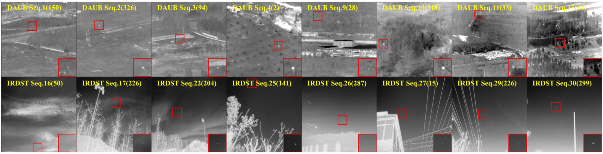
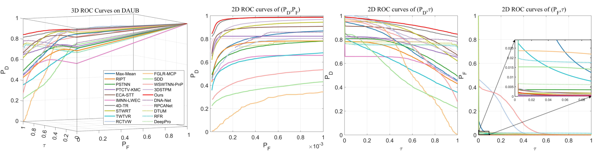
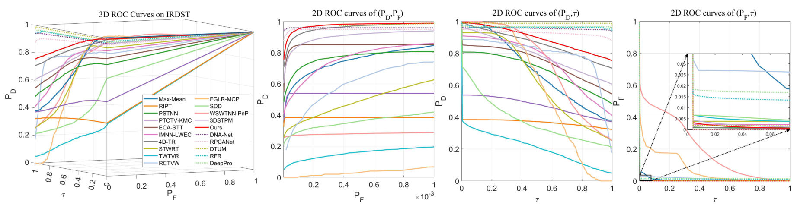

# DNN-aided-LRSD: DNN-aided Low-Rank and Sparse Decomposition for Infrared Small Target Detection


## Abstract
Recently, deep neural network-aided low-rank and sparse decomposition (DNN-aided LRSD) models have received increasing attention for infrared small target detection. The main idea of these methods is to utilize DNNs to learn a dataset-free deep prior as an implicit regularization for the background. In this work, we propose a novel DNN-aided LRSD model, which leverages DNNs to enhance the model's ability to reconstruct low-rank background and detect sparse small targets. First, to efficiently and accurately reconstruct low-rank background, we propose a hierarchical tensor-ring-based background module (HTR) that captures the underlying low-rank structure of the background with compact nonlinear representation. In this module, nonlinear transforms using multilayer perceptrons (MLPs) and parameterized factor tensors are learned from data in an unsupervised manner. Second, to address the limitation of the $l_1$ norm in accurately describing sparse small targets in complex scenes, we specifically design an attention-guided sparse target module (SpAttention). It can progressively focus on the target region during the iterative process, thus improving target saliency and suppressing background structures. Comprehensive experiments on multiple real-world sequences validate the superior performance of our method in target detection and background suppression, surpassing state-of-the-art approaches.

##  Project Structure
```
DNN-aided-LRSD/
├── configs/ # Configuration files
├── datas/ # Dataset files
├── dataset/ # Dataset folder
├── metrics/ # Metric computation modules
├── models/ # LRSD modules
├── result/ # Results
├── utils/ # Utility functions (visualization, logging, etc.)
├── main.py # Main program entry point
└── README.md # Project documentation
```


##  Installation

Create a Python virtual environment and install required packages:

```
#  Create and activate a conda environment
conda create -n DNN_aided_LRSD python=3.11.11
conda activate DNN_aided_LRSD

# Install dependencies from requirements.txt or environment.yml
pip install -r requirements.txt
```

## Dataset

Please download the datasets from their official sources:

- DAUB  
  Paper: A dataset for infrared image dim-small aircraft target detection and tracking under ground / air background. [Official link](https://www.scidb.cn/en/detail?dataSetId=720626420933459968)

- IRDST  
  Paper: Receptive-Field and Direction Induced Attention Network for Infrared Dim Small Target Detection With a Large-Scale Dataset IRDS. [Official link](https://xzbai.buaa.edu.cn/datasets.html)

We also provide a direct download link for convenience: [Baidu Cloud](https://pan.baidu.com/s/125IV9Il24ephlrH36ZZMjQ?pwd=uty7)


After downloading, please organize the data as follows:
```
./datas/DAUB_IRDST/
   images/        # Input infrared image sequences
      seq1/
      seq2/
      ...
   masks/         # Binary masks of targets
      seq1/
      seq2/
      ...
   Zlabe/         # Ground truth target location annotations
      seq1.mat
      seq2.mat
      ...
```

## Evaluation
This unsupervised method is implemented in:
```bash
python main.py
```

Running the above command will automatically process all test sequences,
and the resulting outputs will be saved in the ``./result`` folder.

## Results
### Qualitative results


### Quantitative results






